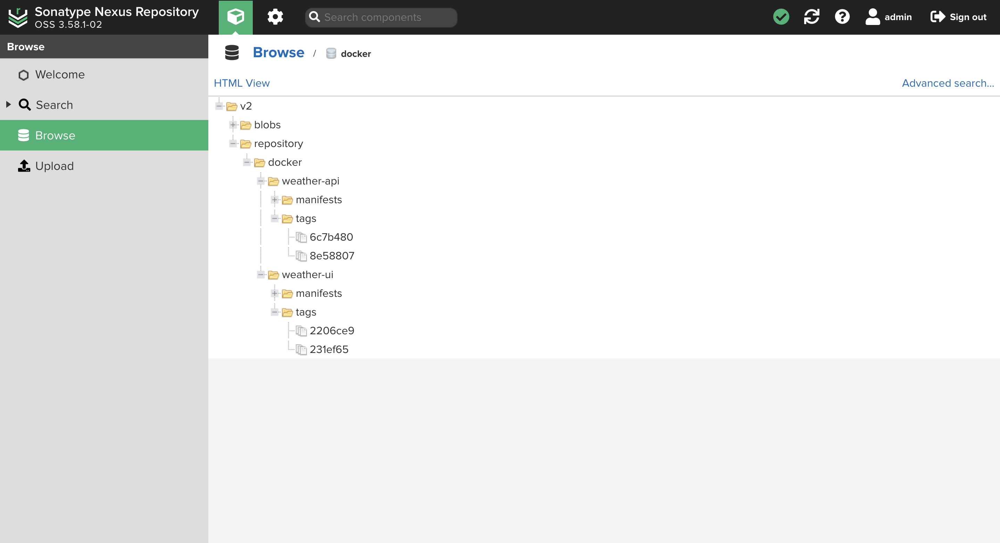

# weather-app-infra

This repository contains the code and instructions to setup necessary infrastructure to build and deploy weather-app-api and weather-app-ui projects.

## Requirements

In order to setup the necessary infrastructure, the following software are required:

- [Ansible](https://docs.ansible.com/ansible/2.9/installation_guide/intro_installation.html)
- [Terraform](https://developer.hashicorp.com/terraform/tutorials/aws-get-started/install-cli)

> **Note**
> The underlying system should meet the hardware requirements to run above software.

## Instructions

### Fork Required GitHub Repositories

Fork [weather-app-api](https://github.com/yedaysal/weather-app-api), [weather-app-ui](https://github.com/yedaysal/weather-app-ui) and [weather-app-infra](https://github.com/yedaysal/weather-app-infra) GitHub repositories into your GitHub account and continue working on the forked weather-app-infra repository on your account.

### Google Cloud Platform (GCP) Configuration Instructions

- Create a GCP account if does not exist and start [Free Trial](https://cloud.google.com/free).
- Login to GCP Web Console.
- On the console:
  - Click on the **Select a project** dropdown button at the upper left side of the page and click on **NEW PROJECT**.
  - On the opening page name your project and note its project ID. Then select it.
  - On the left hand side menu, go to *Compute Engine* and *Kubernetes Engine* services respectively, and enable each of them.
  - On the left hand side menu, go to *IAM & Admin -> Service Accounts*.
    - Click on **CREATE SERVICE ACCOUNT**.
    - Enter “**terraform**” as service account name.
    - Enter “**Service account for terraform to access GCP Compute Engine and Kubernetes Engine**” as service account description.
    - Click on **CREATE AND CONTINUE**.
    - In the opening section, add **Compute Admin**, **Kubernetes Engine Admin**, **Service Account User** roles, and click on **CONTINUE**.
    - In the opening section, click on **DONE**.
  - On the left hand side menu, go to *IAM & Admin -> Service Accounts -> terraform -> Actions column three dots -> Manage keys -> ADD KEY* and click on **Create new key**.
    - Select **JSON** as key type and click on **CREATE**.
    - Rename the downloaded key file as **gcp-terraform-sa-key.json**.
  - Clone this repository.
  - Put the **gcp-terraform-sa-key.json** file to `path/to/local/repo/terraform/gcp/gce`, `path/to/local/repo/terraform/gcp/gke` and `path/to/local/repo/ansible/roles/gcloud/files` directories (create `files` directory) after cloning this repository.

### Google Compute Engine (GCE) Instance Setup Instructions

Open a Terminal window and perform the following:

- cd into `terraform/gcp/gce` directory in the cloned local repository directory.
- Open `variables.tf` file with a text editor and:
  - Change the default value of `project_id` variable (`CHANGEME`) with the project ID of the project you created.
  - Change the default value of `ssh_pub_key` variable (`CHANGEME`) with your SSH public key.
  - Save the changes and close the editor.
- Run `terraform init` command.
- Run `terraform apply -auto-approve` command.
- Note the IP address of the created instance in the `terraform apply` output for future use.

### Google Kubernetes Engine (GKE) Cluster Setup Instructions

Open a Terminal window and perform the following:

- cd into `terraform/gcp/gke` directory in the cloned local repository directory.
- Open `variables.tf` file with a text editor,  change the default value of `project_id` variable (`CHANGEME`) with the project ID of the project you created.
- Run `terraform init` command.
- Run `terraform apply -auto-approve` command.
- Note the values of `kubernetes_cluster_name`, `zone` and `project_id` outputs in the `terraform apply` output to use in the [GCE Instance Software Setup Instructions](#gce-instance-software-setup-instructions) section.

### GCE Instance Software Setup Instructions

Open a Terminal window and follow the steps below:

- cd into `ansible` directory in the cloned local repository directory.
- Run `touch VAULT_PASS` command to create Ansible Vault password file.
- Put initial vault password `3n5dLXH4` into the `VAULT_PASS` file.
- Open `inventory.ini` file with a text editor and change all `CHANGEME` text with the IP address of the GCE instance created in the [Google Compute Engine (GCE) Instance Setup Instructions](#google-compute-engine-gce-instance-setup-instructions) section.
- Open `group_vars/gcloud/vars.yml` file with a text editor and:
  - Change the value of `kubernetes_cluster_name` variable to terraform `kubernetes_cluster_name` output's value.
  - Change the value of `project_id` variable to terraform `project_id` output's value.
  - Change the value of `zone` variable to terraform `zone` output's value.
  - Change `service_account` variable's value to email address of the **terraform** GCP service account (*GCP Web Console -> IAM & Admin -> Service Accounts -> Email column*).
  - Save the changes and close the editor.
- Make sure the current working directory is `ansible`, then run `ansible-playbook main.yml` command. After the execution of `ansible-playbook` command:
  - Nexus 3 web UI is available at `http://GCE_INSTANCE_IP_ADDRESS:8081/`
  - Nginx Proxy Manager web UI is available at `http://GCE_INSTANCE_IP_ADDRESS:81/`
  - Jenkins web UI is available at `http://GCE_INSTANCE_IP_ADDRESS:8080/`
- Save the credentials to access web UIs from the `ansible-playbook` command output for future use.

### Nexus 3 Private Docker Image Registry Configuration Instructions

- Sign in to Nexus 3 web UI (`http://GCE_INSTANCE_IP_ADDRESS:8081/`).
- On the setup wizard, which is opened at first login, perform the following:
  - Provide a new password for the *admin* user.
  - Disable anonymous access to repositories in the instance by selecting **Disable anonymous access** option and complete the setup.
- Click on the wheel icon at the top bar to open server administration and configuration.
- Go to *Repository -> Repositories* and click on **+ Create repository**.
- Select **docker (hosted)** as recipe.
- On the opening page:
  - Name the repository as **docker**.
  - Enable **HTTP** repository connector and give it port number **8082**.
  - Keep the rest of the settings as they are and click on **Create repository** button.

### Duck DNS Domain Configuration Instructions

In order the GKE cluster to access docker images hosted on the Nexus 3 private docker registry, the Nexus 3 instance should respond over HTTPS protocol. To do this, Nginx Proxy Manager (NPM) will be used. The Nexus 3 instance will be placed behind an NPM instance and this NPM instance provide the SSL certificate required to establish HTTPS connection. NPM uses Let's Encrypt SSL certificates and to add an SSL certificate to NPM, a registered domain name is required. This will be provided via Duck DNS.

To register a domain name follow the steps below:

- Go to [www.duckdns.org](https://www.duckdns.org/).
- Sign in with one of the available options.
- Complete the reCaptcha.
- Add a domain.
- Update the IP address of the created domain to GCE instance IP address.
- Save the newly created domain name and the token above for future use.

### Nginx Proxy Manager (NPM) Configuration Instructions

To configure the Nginx Proxy Manager instance for providing HTTPS connection to the Nexus 3 instance, follow the instructions below:

- Sign in to Nginx Proxy Manager web UI (`http://GCE_INSTANCE_IP_ADDRESS:81/`).
- On the opening *Edit User* popup window update the *Email* area and click on **Save** button.
- On the opening *Change Password* popup windows provide a new password and click on **Save** button.
- On the top menu go to *SSL Certificates* and click on **Add SSL Certificate** button.
- On the opening popup window:
  - Enter the domain name created in the [Duck DNS Domain Configuration Instructions](#duck-dns-domain-configuration-instructions) section to *Domain Names* section.
  - Enable **Use a DNS Challenge** option and:
    - Select **DuckDNS** as *DNS Provider*.
    - Enter the DuckDNS token saved in the [Duck DNS Domain Configuration Instructions](#duck-dns-domain-configuration-instructions) to *Credentials File Content* area.
  - Enable **I Agree to the Let's Encrypt Terms of Service** option and click on **Save** button.
- After the SSL certificate is added, go to *Hosts -> Proxy Hosts* on the top menu and click on **Add Proxy Host** button.
- On the opening popup window *Details* section:
  - Enter the domain name created in the [Duck DNS Domain Configuration Instructions](#duck-dns-domain-configuration-instructions) section to *Domain Names* section.
  - Enter the IP address of the GCE instance to *Forward Hostname / IP* section.
  - Enter Nexus 3 docker repository port **8082** to *Forward Port* section.
- On the opening popup window *SSL* section:
  - Select the created SSL certificate in the **SSL Certificate**.
  - Enable **Force SSL** option and click on **Save** button.

After following above steps, the Nexus 3 instance should be accessible over HTTPS.

### GKE Cluster Configuration Instructions

Open a Terminal window and follow the steps below:

- cd into `ansible` directory in the cloned local repository directory.
- Run `ansible-vault edit group_vars/k8s/vault.yml` and:
  - Change `docker_server` variable's value to the domain name created in the [Duck DNS Domain Configuration Instructions](#duck-dns-domain-configuration-instructions) section.
  - Change `docker_username` and `docker_password` variables's values to your Nexus 3 repository login credentials.
- Make sure the current working directory is `ansible`, then run `ansible-playbook plays/k8s.yml` command.

### Application Code Repository Configuration Instructions

The forked weather-app-api and weather-app-ui repositories in your GitHub account needs to be configured since they contain generic values (e.g., `CHANGEME`).

To configure application code repositories in your GitHub account:

- Change the `CHANGEME` values in the `Jenkinsfile` file to your Nexus 3 repository login credentials.
- Change the `CHANGEME` value in the `k8s/deployment.yaml` file to the domain name registered in the [Duck DNS Domain Configuration Instructions](#duck-dns-domain-configuration-instructions) section.
- Go to *Repository Settings -> Code and automation -> Webhooks* and click on **Add webhook** button.
- On the opening page:
  - Enter Jenkins hook URL in the **http://GCE_INSTANCE_IP_ADDRESS:8080/github-webhook/** format to *Payload URL* section.
  - Select **application/json** option in the *Content type* section.
  - Select **Just the push event** option in the *Which events would you like to trigger this webhook?* section.
  - Keep rest of the settings as they are and click on **Add webhook** button.

### Jenkins Configuration Instructions

Follow the instructions below to configure installed Jenkins instance:

#### Initial Jenkins Configuration Instructions

- Sign in to Jenkins web UI (`http://GCE_INSTANCE_IP_ADDRESS:8080/`), enter initial admin password and click on **Continue** button.
- On the opening *Customize Jenkins* page, select **Install suggested plugins** option.
- On the opening *Create First Admin User* page fill in all areas and click on **Save and Continue** button.
- On the opening *Instance Configuration* page enter **http://GCE_INSTANCE_IP_ADDRESS:8080/** as Jenkins URL and click on **Save and Finish**.

#### Pipeline Setup Instructions

- On the Jenkins dashboard, click on **+ New Item**, on the opening page enter a name for Weather API pipeline, select **Pipeline** and click on **OK** button.
- On the opening page select **GitHub hook trigger for GITScm polling** in the *Build Triggers* section.
- In the *Pipeline* section:
  - Select **Pipeline script from SCM** as *Definition*.
  - Select **Git** as *SCM*.
  - Enter the projects HTTPS git URL to *Repository URL* section.
  - Change *Branch Specifier* in the *Branches to build* section to **main** and finally click on **Save** button.
- On the opening pipeline page click on **Build Now** button on the left hand side menu to trigger the pipeline manually once, then the pipeline will be triggered on each push to the repository.
- Repeat above steps to setup a pipeline for Weather UI.

## Accessing Weather API and Weather UI

To access the deployed applications:

- Go to [console.cloud.google.com](https://console.cloud.google.com/).
- On the left hand side menu, go to *NETWORKING -> Network services -> Load balancing* service and click on the Load Balancer which is created after Ingress-Nginx Controller is deployed your GKE cluster. The *Frontend* section on the opening page shows the IP address of the Load Balancer.
  - Weather API is available at `http://LOAD_BALANCER_IP_ADDRESS/api/weather`
  - Weather UI is available at: `http://LOAD_BALANCER_IP_ADDRESS/`

## Screenshots

### GCE Instances

 

### GKE Instance

 

### Nexus 3 Private Docker Repository

 

### Jenkins Weather API Pipeline

 

### Jenkins Weather UI Pipeline

 

### Weather API Screenshot from GKE Instance

 

### Weather UI Screenshot from GKE Instance

 